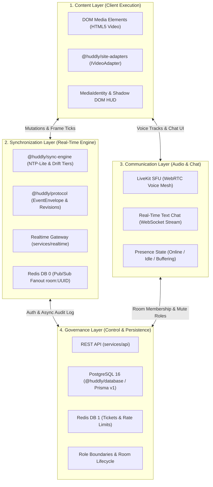
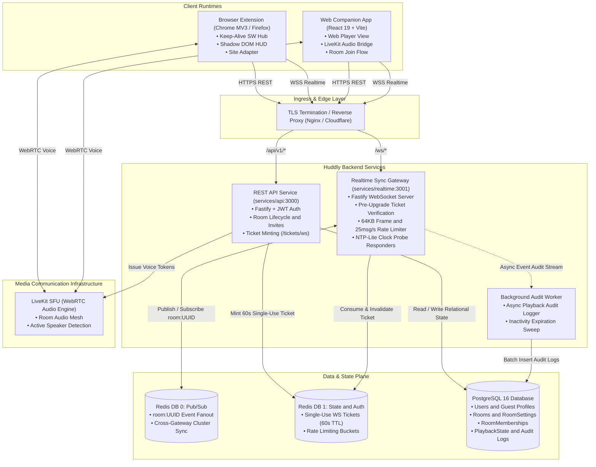
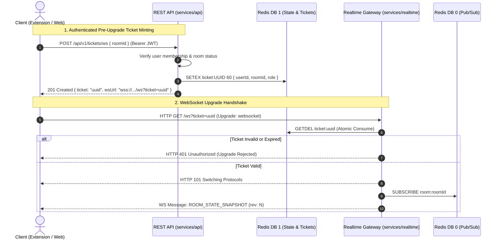
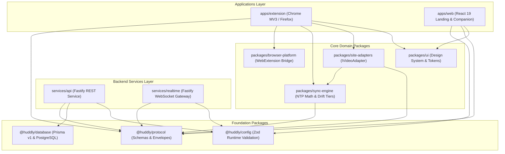

# Huddly Architecture & System Overview

> **Core Philosophy:** _Synchronize state, not pixels._

Huddly is a low-latency co-watching platform. Rather than re-encoding and re-transmitting heavy video feeds over WebRTC, Huddly synchronizes the playback state machine across heterogeneous client video players on the open web, paired with ultra-low-latency text chat and spatial voice communication.

---

## 1. The Four-Layer Mental Model

Every subsystem in Huddly maps directly into one of four architectural layers:



### Layer 1: Content Layer

- **Responsibility:** Interfacing with the host browser's media player and rendering the in-page user interface.
- **Core Components:**
  - **HTML5 Video / Web Players:** Native media elements on any website.
  - **`@huddly/site-adapters` ([ADR-012](file:///Users/bhargavaramthunga/Projects/Huddly/docs/adr/ADR-012-adapter-architecture.md)):** Unified 9-verb player abstraction (`detect`, `getMedia`, `getState`, `play`, `pause`, `seek`, `setRate`, `navigate`, `destroy`) with 4-gate anti-echo protection.
  - **In-Page Watch-Party HUD ([ADR-010](file:///Users/bhargavaramthunga/Projects/Huddly/docs/adr/ADR-010-extension-architecture.md)):** Floating React UI rendered in an Open Shadow DOM host (`<huddly-hud-host>`) with dynamic fullscreen reparenting.

### Layer 2: Synchronization Layer

- **Responsibility:** High-precision, sub-50ms playback alignment across distributed clients.
- **Core Components:**
  - **`@huddly/sync-engine` ([ADR-011](file:///Users/bhargavaramthunga/Projects/Huddly/docs/adr/ADR-011-sync-algorithm.md)):** Pure mathematical synchronization engine. Runs NTP-Lite 4-timestamp clock filtering, expected position projection $P_{\text{expected}}(t)$, and 4-tier drift decision logic (`none`, `nudge-rate`, `soft-seek`, `hard-seek`).
  - **`@huddly/protocol`:** Canonical WebSocket payload schemas and strictly-typed `EventEnvelope<T>` serialization with monotonic `revision` numbers.
  - **Realtime Sync Gateway (`services/realtime`):** Fastify + WebSocket gateway handling client frame limits (64 KB `maxPayload`), per-socket sliding rate limits (25 msg/s), and Redis Pub/Sub cross-gateway fanout.

### Layer 3: Communication Layer

- **Responsibility:** Real-time social interaction (voice and text) during media playback.
- **Core Components:**
  - **Voice Mesh (LiveKit SFU):** Low-latency Selective Forwarding Unit for multi-party audio, active speaker detection, and automatic mic device management.
  - **Text Chat Stream:** Ordered, sanitized (XSS-safe), real-time messaging pipeline delivered over WebSockets with pagination support.
  - **Presence State:** Ephemeral participant presence (`ONLINE`, `IDLE`, `BUFFERING`, `OFFLINE`).

### Layer 4: Governance Layer

- **Responsibility:** Room lifecycle management, authentication, role enforcement, and durable persistence.
- **Core Components:**
  - **REST API (`services/api`):** Fastify HTTP service managing guest authentication, room creation, join validation, and pre-upgrade ticket minting.
  - **Database (`@huddly/database`):** PostgreSQL 16 relational database with Prisma ORM v1 managing users, room settings, memberships, and historical audit logs.
  - **Ticket & Session Cache:** Redis instance dedicated to single-use WebSocket tickets (60s TTL) and IP sliding rate limiters.

---

## 2. End-to-End System Architecture



---

## 3. Key Interaction Workflows

### 3.1 Pre-Upgrade Ticket Gating Handshake

Authentication must **always precede** the WebSocket connection establishment. Clients obtain a cryptographically secure, single-use ticket via REST before initiating the WebSocket upgrade handshake:



### 3.2 Real-Time Playback Synchronization & Asynchronous Audit Path

Playback mutations follow an **asynchronous, non-blocking split path**: events broadcast immediately across Redis Pub/Sub for sub-millisecond client fanout, while durable audit logs flush asynchronously to PostgreSQL:

```mermaid
sequenceDiagram
    autonumber
    actor Host as Host Client (Client A)
    participant GatewayA as Realtime Gateway (Instance A)
    participant RedisPubSub as Redis DB 0 (Pub/Sub)
    participant GatewayB as Realtime Gateway (Instance B)
    actor Participant as Participant (Client B)
    participant Worker as Background Worker
    participant Postgres as PostgreSQL 16

    Host->>Host: User pauses video at t = 42.5s
    Host->>GatewayA: WS: PLAYBACK_PAUSE { mediaId, position: 42.5 }
    GatewayA->>GatewayA: Verify Host authority & increment revision (rev: 11)

    par Immediate Realtime Broadcast (sub-5ms)
        GatewayA->>RedisPubSub: PUBLISH room:UUID { type: "PLAYBACK_PAUSED", pos: 42.5, rev: 11 }
        RedisPubSub->>GatewayB: Fanout to subscribed gateway instances
        GatewayB-->>Participant: WS: PLAYBACK_PAUSED { pos: 42.5, rev: 11 }
        Participant->>Participant: Apply pause via Multi-Gate Mutex (ADR-012)
    and Asynchronous Non-Blocking Persistence
        GatewayA-.->Worker: Push event to async audit queue
        Worker->>Postgres: UPDATE PlaybackState & INSERT PlaybackAuditLog
    end
```

---

## 4. Data Ownership & Storage Matrix

| Data Domain                      | Source of Truth   | Primary Storage                     | Persistence Guarantee     | Invalidation / Lifecycle Policy                            |
| :------------------------------- | :---------------- | :---------------------------------- | :------------------------ | :--------------------------------------------------------- |
| **User & Account Profiles**      | PostgreSQL        | PostgreSQL (`User`, `Account`)      | Durable / Permanent       | Updated on user profile edit.                              |
| **Room Definition & Settings**   | PostgreSQL        | PostgreSQL (`Room`, `RoomSettings`) | Durable / Active lifespan | Retained until room closure or 7-day inactivity purge.     |
| **Active Room Memberships**      | PostgreSQL        | PostgreSQL (`RoomMember`)           | Durable                   | `status` updated to `LEFT` on disconnect; purged on close. |
| **Authoritative Playback State** | Realtime Gateway  | Redis (Cached) + PostgreSQL         | Durable snapshot          | Monotonic `revision` increments on every mutation.         |
| **Pre-Upgrade WS Tickets**       | REST API          | Redis DB 1 (`ticket:UUID`)          | Ephemeral (60s TTL)       | Atomically consumed via `GETDEL` upon WS handshake.        |
| **Rate Limit Buckets**           | Realtime Gateway  | Redis DB 1 (`ratelimit:IP`)         | Ephemeral (1s–60s TTL)    | Sliding window reset.                                      |
| **Pub/Sub Room Fanout**          | WebSocket Gateway | Redis DB 0 (`room:UUID`)            | Pure memory stream        | Ephemeral; zero retention after message dispatch.          |
| **Audio Mesh & Tracks**          | LiveKit SFU       | LiveKit Server Memory               | Ephemeral                 | Active while participants publish WebRTC tracks.           |
| **Client Session Tokens**        | Client Runtime    | `chrome.storage.session` / Memory   | Browser tab lifespan      | Cleared on logout, window close, or tab destroy.           |

---

## 5. Monorepo Topology & Dependency Rules

Huddly enforces strict unidirectional dependency layering across all monorepo packages:



### Dependency Invariants:

1. **`@huddly/protocol` is Leaf-Level:** Zero internal workspace dependencies. Contains only pure Zod schemas and TypeScript types.
2. **`@huddly/sync-engine` is Pure Mathematics:** No DOM, timer, or socket dependencies. Tested exhaustively via pure functions.
3. **`@huddly/site-adapters` is DOM-Only:** Must not import `chrome.*` or `browser.*` globals. Platform escalation is strictly isolated to `packages/browser-platform`.
4. **Backend Services are Decoupled:** `services/api` and `services/realtime` do not import each other; they communicate exclusively via shared data planes (Postgres and Redis).

---

## 6. Architectural Decision Records (ADRs)

Key architectural decisions are formally documented in our ADR repository:

| ADR                                                                                                       | Title                                     | Status       | Summary                                                                                                                        |
| :-------------------------------------------------------------------------------------------------------- | :---------------------------------------- | :----------- | :----------------------------------------------------------------------------------------------------------------------------- |
| **[ADR-010](file:///Users/bhargavaramthunga/Projects/Huddly/docs/adr/ADR-010-extension-architecture.md)** | Extension Architecture & Runtime Contexts | **Accepted** | Defines Keep-Alive SW hub, Open Shadow DOM in-page HUD, fullscreen reparenting, and cross-browser abstractions.                |
| **[ADR-011](file:///Users/bhargavaramthunga/Projects/Huddly/docs/adr/ADR-011-sync-algorithm.md)**         | Playback Synchronization Algorithm        | **Accepted** | Defines NTP-Lite 4-timestamp clock filter, continuous projection $P(t)$, 4-tier drift ladder, and buffer stall policies.       |
| **[ADR-012](file:///Users/bhargavaramthunga/Projects/Huddly/docs/adr/ADR-012-adapter-architecture.md)**   | Video Site Adapter Architecture           | **Accepted** | Standardizes `IVideoAdapter` 9-verb contract, multi-gate anti-echo state machine, Web Worker ticker, and legal/DRM boundaries. |
| **[ADR-013](file:///Users/bhargavaramthunga/Projects/Huddly/docs/adr/ADR-013-license.md)**                | Project License (Apache 2.0)              | **Accepted** | Establishes Apache License 2.0 with express patent grants and patent retaliation provisions.                                   |

---

## 7. Performance & Latency Targets (SLA)

| Metric                         | Target SLA                                               | Strategy                                                                        |
| :----------------------------- | :------------------------------------------------------- | :------------------------------------------------------------------------------ |
| **Playback Sync Drift**        | **$< 50\text{ ms}$ (Typical) / $< 200\text{ ms}$ (p95)** | Continuous NTP-Lite clock filtering with micro rate-nudging ($\pm 5\%$).        |
| **Audio Latency (LiveKit)**    | **$< 150\text{ ms}$ (p95)**                              | WebRTC OPUS audio stream via localized SFU edge routing.                        |
| **WS Fanout Latency**          | **$< 15\text{ ms}$ (p99)**                               | Redis Pub/Sub in-memory room broadcast across gateway instances.                |
| **Time-to-First-Playback**     | **$< 1.2\text{ s}$**                                     | Pre-upgrade ticket handshake with single-trip room state snapshot delivery.     |
| **Extension Memory Footprint** | **$< 25\text{ MB}$**                                     | Shadow DOM injection with isolated React 19 micro-root and lean component tree. |
