# Huddly Database Schema Specification — v1

> **Status:** Finalized (ARCH-011) · **Target Milestone:** M0–M1 · **Database Engine:** PostgreSQL 16+

This document defines the relational database schema, Mermaid ERD, table definitions, constraints, indexes, retention policies, hot query coverage, user erasure pathways, and data ownership boundaries for Huddly.

---

## 1. Data Ownership Boundary: PostgreSQL vs. Redis

Huddly enforces a strict separation of concerns between permanent and ephemeral state:

```text
┌──────────────────────────────────────────────┐    ┌──────────────────────────────────────────────┐
│         PostgreSQL (Permanent Truth)         │    │           Redis (Ephemeral State)            │
├──────────────────────────────────────────────┤    ├──────────────────────────────────────────────┤
│ • Users, credentials, and devices            │    │ • Presence tracking (online/idle/heartbeats) │
│ • Rooms, settings, invites, and memberships  │    │ • Distributed room mutex locks (Redlock)     │
│ • Canonical playback state & revision logs   │    │ • Realtime pub/sub event distribution        │
│ • Chat history & message reactions           │    │ • Token bucket rate limiting counters        │
│ • Moderation actions & immutable audit logs  │    │ • Ephemeral session & room lookup caches     │
└──────────────────────────────────────────────┘    └──────────────────────────────────────────────┘
```

> **Invariant:** **PostgreSQL is the single source of truth.** Redis is strictly an ephemeral acceleration and coordination layer. If Redis suffers total data loss or restarts, the system recovers completely from PostgreSQL with zero permanent state degradation. Redis must never store unpersisted business data.

---

## 2. Entity-Relationship Diagram (ERD)

```mermaid
erDiagram
    users ||--o{ user_devices : "owns"
    users ||--o{ rooms : "creates"
    users ||--o{ room_members : "participates_in"
    users ||--o{ chat_messages : "sends"
    users ||--o{ message_reactions : "reacts"
    users ||--o{ moderation_actions : "executes/targets"
    users ||--o{ audit_events : "triggers"

    rooms ||--|| room_settings : "configured_by"
    rooms ||--o{ room_members : "contains"
    rooms ||--o{ room_permissions : "defines"
    rooms ||--o{ room_invites : "issues"
    rooms ||--o{ media_sessions : "hosts"
    rooms ||--|| playback_states : "tracks_current"
    rooms ||--o{ playback_events : "records_history"
    rooms ||--o{ navigation_states : "observes"
    rooms ||--o{ chat_messages : "holds"
    rooms ||--o{ moderation_actions : "applies_within"
    rooms ||--o{ audit_events : "scoped_to"

    media_sessions ||--o{ playback_events : "generates"
    chat_messages ||--o{ message_reactions : "receives"

    users {
        uuid id PK
        varchar email UK
        varchar password_hash
        varchar display_name
        varchar avatar_url
        boolean is_guest
        varchar status
        timestamptz created_at
        timestamptz updated_at
    }

    user_devices {
        uuid id PK
        uuid user_id FK
        varchar device_type
        varchar user_agent
        varchar push_token
        varchar refresh_token_hash
        timestamptz last_seen_at
        timestamptz created_at
    }

    rooms {
        uuid id PK
        varchar room_code UK
        varchar name
        uuid host_user_id FK
        varchar status
        timestamptz last_active_at
        timestamptz expires_at
        timestamptz created_at
        timestamptz updated_at
    }

    room_settings {
        uuid room_id PK, FK
        integer max_participants
        boolean is_locked
        boolean allow_guest_chat
        boolean allow_guest_voice
        varchar default_member_role
        boolean auto_close_on_host_leave
        timestamptz updated_at
    }

    room_members {
        uuid id PK
        uuid room_id FK
        uuid user_id FK
        varchar role
        varchar display_name
        timestamptz joined_at
        timestamptz left_at
    }

    room_permissions {
        uuid id PK
        uuid room_id FK
        varchar role
        boolean can_control_playback
        boolean can_change_media
        boolean can_send_chat
        boolean can_speak
        boolean can_invite
        boolean can_kick
        timestamptz updated_at
    }

    media_sessions {
        uuid id PK
        uuid room_id FK
        varchar media_url
        varchar media_title
        varchar provider_name
        double_precision duration
        timestamptz started_at
        timestamptz ended_at
    }

    playback_states {
        uuid room_id PK, FK
        uuid media_session_id FK
        double_precision position
        boolean is_playing
        double_precision playback_rate
        bigint revision
        uuid controller_user_id FK
        timestamptz server_timestamp
        timestamptz updated_at
    }

    playback_events {
        uuid id PK
        uuid room_id FK
        uuid media_session_id FK
        uuid actor_user_id FK
        varchar event_type
        bigint revision
        double_precision position
        double_precision playback_rate
        timestamptz server_timestamp
        jsonb payload
    }

    navigation_states {
        uuid id PK
        uuid room_id FK
        uuid actor_user_id FK
        varchar url
        varchar page_title
        bigint revision
        timestamptz server_timestamp
    }

    chat_messages {
        uuid id PK
        uuid room_id FK
        uuid sender_user_id FK
        text content
        varchar status
        timestamptz created_at
        timestamptz deleted_at
    }

    message_reactions {
        uuid id PK
        uuid message_id FK
        uuid user_id FK
        varchar reaction
        timestamptz created_at
    }

    room_invites {
        uuid id PK
        uuid room_id FK
        varchar invite_code UK
        uuid created_by_user_id FK
        integer max_uses
        integer uses_count
        timestamptz expires_at
        timestamptz created_at
    }

    moderation_actions {
        uuid id PK
        uuid room_id FK
        uuid moderator_user_id FK
        uuid target_user_id FK
        varchar action_type
        text reason
        timestamptz expires_at
        timestamptz created_at
    }

    audit_events {
        uuid id PK
        uuid room_id FK
        uuid actor_user_id FK
        varchar event_name
        inet ip_address
        varchar user_agent
        timestamptz created_at
        jsonb metadata
    }
```



---

## 3. Detailed Table Specifications

> **Indexing Standard:** Foreign keys and hot query predicate columns are explicitly indexed. JSONB is reserved strictly for arbitrary event payloads and audit metadata, never for columns filtered in relational queries.

### 3.1 `users`

**Purpose:** Stores user identities, credentials, authentication status, and guest flags.

| Column          | Postgres Type   | Nullable | Default             | Description & Constraints                           |
| --------------- | --------------- | -------- | ------------------- | --------------------------------------------------- |
| `id`            | `UUID`          | No       | `gen_random_uuid()` | Primary Key                                         |
| `email`         | `VARCHAR(255)`  | Yes      | `NULL`              | Unique when not null (`UNIQUE NULLS DISTINCT`)      |
| `password_hash` | `VARCHAR(255)`  | Yes      | `NULL`              | Argon2id password hash (null for guest/OAuth users) |
| `display_name`  | `VARCHAR(50)`   | No       | —                   | User display name                                   |
| `avatar_url`    | `VARCHAR(2048)` | Yes      | `NULL`              | URL to user avatar image                            |
| `is_guest`      | `BOOLEAN`       | No       | `false`             | True if this user was created as an anonymous guest |
| `status`        | `VARCHAR(32)`   | No       | `'ACTIVE'`          | User state: `'ACTIVE'`, `'SUSPENDED'`, `'DELETED'`  |
| `created_at`    | `TIMESTAMPTZ`   | No       | `now()`             | Record creation timestamp                           |
| `updated_at`    | `TIMESTAMPTZ`   | No       | `now()`             | Record last update timestamp                        |

**Indexes & Constraints:**

- `pk_users`: `PRIMARY KEY (id)`
- `uq_users_email`: `UNIQUE (email) WHERE email IS NOT NULL`
- `idx_users_guest_created`: `INDEX (is_guest, created_at) WHERE is_guest = true` (for guest cleanup jobs)

---

### 3.2 `user_devices`

**Purpose:** Tracks active client sessions, refresh tokens, and push notification endpoints.

| Column               | Postgres Type  | Nullable | Default             | Description & Constraints                                                                  |
| -------------------- | -------------- | -------- | ------------------- | ------------------------------------------------------------------------------------------ |
| `id`                 | `UUID`         | No       | `gen_random_uuid()` | Primary Key                                                                                |
| `user_id`            | `UUID`         | No       | —                   | Foreign Key $\to$ `users(id)` ON DELETE CASCADE                                            |
| `device_type`        | `VARCHAR(32)`  | No       | `'WEB'`             | Device class: `'CHROME_EXT'`, `'FIREFOX_EXT'`, `'WEB'`, `'MOBILE_ANDROID'`, `'MOBILE_IOS'` |
| `user_agent`         | `VARCHAR(512)` | Yes      | `NULL`              | Client user agent header                                                                   |
| `push_token`         | `VARCHAR(512)` | Yes      | `NULL`              | Device push notification token                                                             |
| `refresh_token_hash` | `VARCHAR(255)` | Yes      | `NULL`              | Secure hash of active refresh token                                                        |
| `last_seen_at`       | `TIMESTAMPTZ`  | No       | `now()`             | Last client activity timestamp                                                             |
| `created_at`         | `TIMESTAMPTZ`  | No       | `now()`             | Session creation timestamp                                                                 |

**Indexes & Constraints:**

- `pk_user_devices`: `PRIMARY KEY (id)`
- `idx_user_devices_user_seen`: `INDEX (user_id, last_seen_at DESC)`
- `idx_user_devices_token`: `INDEX (refresh_token_hash) WHERE refresh_token_hash IS NOT NULL`

---

### 3.3 `rooms`

**Purpose:** The central room entity representing an active or historical co-watching session.

| Column           | Postgres Type  | Nullable | Default             | Description & Constraints                        |
| ---------------- | -------------- | -------- | ------------------- | ------------------------------------------------ |
| `id`             | `UUID`         | No       | `gen_random_uuid()` | Primary Key                                      |
| `room_code`      | `VARCHAR(16)`  | No       | —                   | Unique human-readable code for joining           |
| `name`           | `VARCHAR(100)` | No       | `'Watch Room'`      | Human-readable room title                        |
| `host_user_id`   | `UUID`         | No       | —                   | Foreign Key $\to$ `users(id)` ON DELETE RESTRICT |
| `status`         | `VARCHAR(32)`  | No       | `'ACTIVE'`          | Room status: `'ACTIVE'`, `'PAUSED'`, `'CLOSED'`  |
| `last_active_at` | `TIMESTAMPTZ`  | No       | `now()`             | Updated on playback or chat activity             |
| `expires_at`     | `TIMESTAMPTZ`  | No       | —                   | Expiration timestamp for automatic room closure  |
| `created_at`     | `TIMESTAMPTZ`  | No       | `now()`             | Room creation timestamp                          |
| `updated_at`     | `TIMESTAMPTZ`  | No       | `now()`             | Room last modification timestamp                 |

> **Entropy & Room Code Generation:** `room_code` is a collision-resistant, URL-safe alphanumeric string (e.g., `hud-7k9p-m2x4`, minimum 10 base-32 characters, $\approx 50\text{ bits of entropy}$). It prevents brute-force enumeration attacks while remaining easy for users to type.

**Indexes & Constraints:**

- `pk_rooms`: `PRIMARY KEY (id)`
- `uq_rooms_code`: `UNIQUE (room_code)`
- `idx_rooms_status_expires`: `INDEX (status, expires_at)` (for room cleanup worker)
- `idx_rooms_host`: `INDEX (host_user_id)`

---

### 3.4 `room_settings`

**Purpose:** Configuration parameters, locks, and permission policies for a specific room.

| Column                     | Postgres Type | Nullable | Default         | Description & Constraints                                     |
| -------------------------- | ------------- | -------- | --------------- | ------------------------------------------------------------- |
| `room_id`                  | `UUID`        | No       | —               | Primary Key & Foreign Key $\to$ `rooms(id)` ON DELETE CASCADE |
| `max_participants`         | `INTEGER`     | No       | `10`            | Maximum allowed concurrent participants (MVP limit: 10)       |
| `is_locked`                | `BOOLEAN`     | No       | `false`         | When true, new participants cannot join                       |
| `allow_guest_chat`         | `BOOLEAN`     | No       | `true`          | When false, guests cannot send chat messages                  |
| `allow_guest_voice`        | `BOOLEAN`     | No       | `true`          | When false, guests cannot publish audio tracks                |
| `default_member_role`      | `VARCHAR(32)` | No       | `'PARTICIPANT'` | Default role assigned to new members                          |
| `auto_close_on_host_leave` | `BOOLEAN`     | No       | `false`         | If true, room terminates when host departs                    |
| `updated_at`               | `TIMESTAMPTZ` | No       | `now()`         | Timestamp of last settings update                             |

**Indexes & Constraints:**

- `pk_room_settings`: `PRIMARY KEY (room_id)`

---

### 3.5 `room_members`

**Purpose:** Tracks room membership, roles, join times, and departure timestamps.

| Column         | Postgres Type | Nullable | Default             | Description & Constraints                                           |
| -------------- | ------------- | -------- | ------------------- | ------------------------------------------------------------------- |
| `id`           | `UUID`        | No       | `gen_random_uuid()` | Primary Key                                                         |
| `room_id`      | `UUID`        | No       | —                   | Foreign Key $\to$ `rooms(id)` ON DELETE CASCADE                     |
| `user_id`      | `UUID`        | No       | —                   | Foreign Key $\to$ `users(id)` ON DELETE CASCADE                     |
| `role`         | `VARCHAR(32)` | No       | `'PARTICIPANT'`     | Member role: `'HOST'`, `'MODERATOR'`, `'PARTICIPANT'`, `'OBSERVER'` |
| `display_name` | `VARCHAR(50)` | No       | —                   | Snapshot of member's room display name                              |
| `joined_at`    | `TIMESTAMPTZ` | No       | `now()`             | Timestamp when member joined                                        |
| `left_at`      | `TIMESTAMPTZ` | Yes      | `NULL`              | Timestamp when member departed (`NULL` if active)                   |

**Indexes & Constraints:**

- `pk_room_members`: `PRIMARY KEY (id)`
- `idx_room_members_active`: `INDEX (room_id, user_id) WHERE left_at IS NULL`
- `idx_room_members_list`: `INDEX (room_id, joined_at) WHERE left_at IS NULL`
- `idx_room_members_user`: `INDEX (user_id)`

---

### 3.6 `room_permissions`

**Purpose:** Role-based access control permissions within a room.

| Column                 | Postgres Type | Nullable | Default             | Description & Constraints                             |
| ---------------------- | ------------- | -------- | ------------------- | ----------------------------------------------------- |
| `id`                   | `UUID`        | No       | `gen_random_uuid()` | Primary Key                                           |
| `room_id`              | `UUID`        | No       | —                   | Foreign Key $\to$ `rooms(id)` ON DELETE CASCADE       |
| `role`                 | `VARCHAR(32)` | No       | —                   | Target role: `'HOST'`, `'MODERATOR'`, `'PARTICIPANT'` |
| `can_control_playback` | `BOOLEAN`     | No       | `false`             | Permission to play, pause, seek, set rate             |
| `can_change_media`     | `BOOLEAN`     | No       | `false`             | Permission to change current media URL                |
| `can_send_chat`        | `BOOLEAN`     | No       | `true`              | Permission to post chat messages                      |
| `can_speak`            | `BOOLEAN`     | No       | `true`              | Permission to publish WebRTC audio                    |
| `can_invite`           | `BOOLEAN`     | No       | `true`              | Permission to generate invite links                   |
| `can_kick`             | `BOOLEAN`     | No       | `false`             | Permission to remove participants                     |
| `updated_at`           | `TIMESTAMPTZ` | No       | `now()`             | Last permission update timestamp                      |

**Indexes & Constraints:**

- `pk_room_permissions`: `PRIMARY KEY (id)`
- `uq_room_permissions_role`: `UNIQUE (room_id, role)`

---

### 3.7 `media_sessions`

**Purpose:** Represents a specific media item loaded for synchronization within a room.

| Column          | Postgres Type      | Nullable | Default             | Description & Constraints                       |
| --------------- | ------------------ | -------- | ------------------- | ----------------------------------------------- |
| `id`            | `UUID`             | No       | `gen_random_uuid()` | Primary Key                                     |
| `room_id`       | `UUID`             | No       | —                   | Foreign Key $\to$ `rooms(id)` ON DELETE CASCADE |
| `media_url`     | `VARCHAR(2048)`    | No       | —                   | Canonical web URL of media                      |
| `media_title`   | `VARCHAR(255)`     | Yes      | `NULL`              | Detected title of media item                    |
| `provider_name` | `VARCHAR(64)`      | No       | `'GENERIC_HTML5'`   | Adapter/provider identifier                     |
| `duration`      | `DOUBLE PRECISION` | Yes      | `NULL`              | Total duration in seconds                       |
| `started_at`    | `TIMESTAMPTZ`      | No       | `now()`             | When media was loaded in room                   |
| `ended_at`      | `TIMESTAMPTZ`      | Yes      | `NULL`              | When media was unloaded/replaced                |

**Indexes & Constraints:**

- `pk_media_sessions`: `PRIMARY KEY (id)`
- `idx_media_sessions_room_active`: `INDEX (room_id, started_at DESC)`

---

### 3.8 `playback_states`

**Purpose:** Holds the single canonical, current playback state and monotonically increasing revision for each room.

| Column               | Postgres Type      | Nullable | Default | Description & Constraints                                     |
| -------------------- | ------------------ | -------- | ------- | ------------------------------------------------------------- |
| `room_id`            | `UUID`             | No       | —       | Primary Key & Foreign Key $\to$ `rooms(id)` ON DELETE CASCADE |
| `media_session_id`   | `UUID`             | Yes      | `NULL`  | Foreign Key $\to$ `media_sessions(id)` ON DELETE SET NULL     |
| `position`           | `DOUBLE PRECISION` | No       | `0.0`   | Playback position in seconds                                  |
| `is_playing`         | `BOOLEAN`          | No       | `false` | Playback activity state                                       |
| `playback_rate`      | `DOUBLE PRECISION` | No       | `1.0`   | Playback speed ($0.25\times \dots 4.0\times$)                 |
| `revision`           | `BIGINT`           | No       | `0`     | Monotonically increasing room revision counter                |
| `controller_user_id` | `UUID`             | Yes      | `NULL`  | Foreign Key $\to$ `users(id)` ON DELETE SET NULL              |
| `server_timestamp`   | `TIMESTAMPTZ`      | No       | `now()` | Exact server clock time when position was recorded            |
| `updated_at`         | `TIMESTAMPTZ`      | No       | `now()` | Record update timestamp                                       |

**Indexes & Constraints:**

- `pk_playback_states`: `PRIMARY KEY (room_id)`
- `idx_playback_states_controller`: `INDEX (controller_user_id)`

---

### 3.9 `playback_events`

**Purpose:** High-frequency append-only ledger of playback state transitions for diagnostics, telemetry, and audit.

| Column             | Postgres Type      | Nullable | Default             | Description & Constraints                                 |
| ------------------ | ------------------ | -------- | ------------------- | --------------------------------------------------------- |
| `id`               | `UUID`             | No       | `gen_random_uuid()` | Primary Key                                               |
| `room_id`          | `UUID`             | No       | —                   | Foreign Key $\to$ `rooms(id)` ON DELETE CASCADE           |
| `media_session_id` | `UUID`             | Yes      | `NULL`              | Foreign Key $\to$ `media_sessions(id)` ON DELETE SET NULL |
| `actor_user_id`    | `UUID`             | Yes      | `NULL`              | Foreign Key $\to$ `users(id)` ON DELETE SET NULL          |
| `event_type`       | `VARCHAR(64)`      | No       | —                   | Event name (`PLAY`, `PAUSE`, `SEEK`, `RATE`, etc.)        |
| `revision`         | `BIGINT`           | No       | —                   | Assigned room revision number                             |
| `position`         | `DOUBLE PRECISION` | No       | —                   | Position at event timestamp                               |
| `playback_rate`    | `DOUBLE PRECISION` | No       | `1.0`               | Playback rate at event                                    |
| `server_timestamp` | `TIMESTAMPTZ`      | No       | `now()`             | Authoritative server timestamp                            |
| `payload`          | `JSONB`            | Yes      | `'{}'::jsonb`       | Non-queryable raw payload metadata                        |

**Indexes & Constraints:**

- `pk_playback_events`: `PRIMARY KEY (id)`
- `idx_playback_events_room_rev`: `INDEX (room_id, revision DESC)`
- `idx_playback_events_created`: `INDEX (server_timestamp)` (for cleanup pruning)

---

### 3.10 `navigation_states`

**Purpose:** Tracks room web page navigation history and synchronization targets.

| Column             | Postgres Type   | Nullable | Default             | Description & Constraints                        |
| ------------------ | --------------- | -------- | ------------------- | ------------------------------------------------ |
| `id`               | `UUID`          | No       | `gen_random_uuid()` | Primary Key                                      |
| `room_id`          | `UUID`          | No       | —                   | Foreign Key $\to$ `rooms(id)` ON DELETE CASCADE  |
| `actor_user_id`    | `UUID`          | Yes      | `NULL`              | Foreign Key $\to$ `users(id)` ON DELETE SET NULL |
| `url`              | `VARCHAR(2048)` | No       | —                   | Current room URL                                 |
| `page_title`       | `VARCHAR(255)`  | Yes      | `NULL`              | Web page title                                   |
| `revision`         | `BIGINT`        | No       | —                   | Sequence revision number                         |
| `server_timestamp` | `TIMESTAMPTZ`   | No       | `now()`             | Server timestamp                                 |

**Indexes & Constraints:**

- `pk_navigation_states`: `PRIMARY KEY (id)`
- `idx_navigation_states_room`: `INDEX (room_id, revision DESC)`

---

### 3.11 `chat_messages`

**Purpose:** Persisted linear text messages sent inside a room.

| Column           | Postgres Type | Nullable | Default             | Description & Constraints                           |
| ---------------- | ------------- | -------- | ------------------- | --------------------------------------------------- |
| `id`             | `UUID`        | No       | `gen_random_uuid()` | Primary Key                                         |
| `room_id`        | `UUID`        | No       | —                   | Foreign Key $\to$ `rooms(id)` ON DELETE CASCADE     |
| `sender_user_id` | `UUID`        | Yes      | `NULL`              | Foreign Key $\to$ `users(id)` ON DELETE SET NULL    |
| `content`        | `TEXT`        | No       | —                   | Sanitized message text (max 2000 chars)             |
| `status`         | `VARCHAR(32)` | No       | `'ACTIVE'`          | Message state: `'ACTIVE'`, `'DELETED'`, `'FLAGGED'` |
| `created_at`     | `TIMESTAMPTZ` | No       | `now()`             | Creation timestamp                                  |
| `deleted_at`     | `TIMESTAMPTZ` | Yes      | `NULL`              | Soft-deletion timestamp                             |

**Indexes & Constraints:**

- `pk_chat_messages`: `PRIMARY KEY (id)`
- `idx_chat_messages_room_time`: `INDEX (room_id, created_at DESC)` (for pagination)
- `idx_chat_messages_sender`: `INDEX (sender_user_id)`

---

### 3.12 `message_reactions`

**Purpose:** Emoji reactions attached to chat messages.

| Column       | Postgres Type | Nullable | Default             | Description & Constraints                                   |
| ------------ | ------------- | -------- | ------------------- | ----------------------------------------------------------- |
| `id`         | `UUID`        | No       | `gen_random_uuid()` | Primary Key                                                 |
| `message_id` | `UUID`        | No       | —                   | Foreign Key $\to$ `chat_messages(id)` ON DELETE CASCADE     |
| `user_id`    | `UUID`        | No       | —                   | Foreign Key $\to$ `users(id)` ON DELETE CASCADE             |
| `reaction`   | `VARCHAR(32)` | No       | —                   | Standard unicode emoji string (e.g. `'👍'`, `'❤️'`, `'😂'`) |
| `created_at` | `TIMESTAMPTZ` | No       | `now()`             | Reaction timestamp                                          |

**Indexes & Constraints:**

- `pk_message_reactions`: `PRIMARY KEY (id)`
- `uq_message_reactions_user`: `UNIQUE (message_id, user_id, reaction)` (enforces one reaction per emoji per user)
- `idx_message_reactions_msg`: `INDEX (message_id)`

---

### 3.13 `room_invites`

**Purpose:** Shareable invite codes/links for entering a room.

| Column               | Postgres Type | Nullable | Default             | Description & Constraints                             |
| -------------------- | ------------- | -------- | ------------------- | ----------------------------------------------------- |
| `id`                 | `UUID`        | No       | `gen_random_uuid()` | Primary Key                                           |
| `room_id`            | `UUID`        | No       | —                   | Foreign Key $\to$ `rooms(id)` ON DELETE CASCADE       |
| `invite_code`        | `VARCHAR(32)` | No       | —                   | Collision-resistant invite code (e.g. `inv_x7k9p2m4`) |
| `created_by_user_id` | `UUID`        | Yes      | `NULL`              | Foreign Key $\to$ `users(id)` ON DELETE SET NULL      |
| `max_uses`           | `INTEGER`     | Yes      | `NULL`              | Maximum allowed joins (`NULL` = unlimited)            |
| `uses_count`         | `INTEGER`     | No       | `0`                 | Current join count                                    |
| `expires_at`         | `TIMESTAMPTZ` | Yes      | `NULL`              | Expiration timestamp (`NULL` = never)                 |
| `created_at`         | `TIMESTAMPTZ` | No       | `now()`             | Creation timestamp                                    |

**Indexes & Constraints:**

- `pk_room_invites`: `PRIMARY KEY (id)`
- `uq_room_invites_code`: `UNIQUE (invite_code)`
- `idx_room_invites_room`: `INDEX (room_id)`

---

### 3.14 `moderation_actions`

**Purpose:** Log of moderation interventions (kicks, mutes, message deletions) executed within a room.

| Column              | Postgres Type | Nullable | Default             | Description & Constraints                                           |
| ------------------- | ------------- | -------- | ------------------- | ------------------------------------------------------------------- |
| `id`                | `UUID`        | No       | `gen_random_uuid()` | Primary Key                                                         |
| `room_id`           | `UUID`        | No       | —                   | Foreign Key $\to$ `rooms(id)` ON DELETE CASCADE                     |
| `moderator_user_id` | `UUID`        | Yes      | `NULL`              | Foreign Key $\to$ `users(id)` ON DELETE SET NULL                    |
| `target_user_id`    | `UUID`        | Yes      | `NULL`              | Foreign Key $\to$ `users(id)` ON DELETE SET NULL                    |
| `action_type`       | `VARCHAR(32)` | No       | —                   | Action: `'KICK'`, `'MUTE_CHAT'`, `'MUTE_VOICE'`, `'DELETE_MESSAGE'` |
| `reason`            | `TEXT`        | Yes      | `NULL`              | Human or policy reason string                                       |
| `expires_at`        | `TIMESTAMPTZ` | Yes      | `NULL`              | Duration expiration for temporary mutes                             |
| `created_at`        | `TIMESTAMPTZ` | No       | `now()`             | Timestamp of action                                                 |

**Indexes & Constraints:**

- `pk_moderation_actions`: `PRIMARY KEY (id)`
- `idx_moderation_actions_target`: `INDEX (room_id, target_user_id, action_type)`
- `idx_moderation_actions_created`: `INDEX (created_at)`

---

### 3.15 `audit_events`

**Purpose:** Append-only security and operational audit trail.

| Column          | Postgres Type  | Nullable | Default             | Description & Constraints                                            |
| --------------- | -------------- | -------- | ------------------- | -------------------------------------------------------------------- |
| `id`            | `UUID`         | No       | `gen_random_uuid()` | Primary Key                                                          |
| `room_id`       | `UUID`         | Yes      | `NULL`              | Foreign Key $\to$ `rooms(id)` ON DELETE SET NULL                     |
| `actor_user_id` | `UUID`         | Yes      | `NULL`              | Foreign Key $\to$ `users(id)` ON DELETE SET NULL                     |
| `event_name`    | `VARCHAR(64)`  | No       | —                   | Event name (e.g. `'AUTH_LOGIN'`, `'ROOM_CREATED'`, `'ROLE_CHANGED'`) |
| `ip_address`    | `INET`         | Yes      | `NULL`              | Client IP address                                                    |
| `user_agent`    | `VARCHAR(512)` | Yes      | `NULL`              | Client user agent                                                    |
| `created_at`    | `TIMESTAMPTZ`  | No       | `now()`             | Timestamp of audit event                                             |
| `metadata`      | `JSONB`        | Yes      | `'{}'::jsonb`       | Additional contextual details                                        |

**Indexes & Constraints:**

- `pk_audit_events`: `PRIMARY KEY (id)`
- `idx_audit_events_actor`: `INDEX (actor_user_id, created_at DESC)`
- `idx_audit_events_room`: `INDEX (room_id, created_at DESC)`
- `idx_audit_events_created`: `INDEX (created_at)` (for partitioning / archival)

---

## 4. Hot Queries & Index Coverage

| Hot Query                                 | SQL Pattern                                                                                              | Covered Index                                                      |
| ----------------------------------------- | -------------------------------------------------------------------------------------------------------- | ------------------------------------------------------------------ |
| **Fetch last 50 chat messages in a room** | `SELECT * FROM chat_messages WHERE room_id = $1 AND status = 'ACTIVE' ORDER BY created_at DESC LIMIT 50` | `idx_chat_messages_room_time (room_id, created_at DESC)`           |
| **List active members in a room**         | `SELECT * FROM room_members WHERE room_id = $1 AND left_at IS NULL ORDER BY joined_at ASC`               | `idx_room_members_list (room_id, joined_at) WHERE left_at IS NULL` |
| **Fetch current playback state**          | `SELECT * FROM playback_states WHERE room_id = $1`                                                       | `pk_playback_states (room_id)`                                     |
| **Resolve room invite code**              | `SELECT * FROM room_invites WHERE invite_code = $1 AND (expires_at IS NULL OR expires_at > now())`       | `uq_room_invites_code (invite_code)`                               |
| **Find user by email for login**          | `SELECT * FROM users WHERE email = LOWER($1) AND status = 'ACTIVE'`                                      | `uq_users_email (email)`                                           |
| **Find active devices / tokens**          | `SELECT * FROM user_devices WHERE user_id = $1 ORDER BY last_seen_at DESC`                               | `idx_user_devices_user_seen (user_id, last_seen_at DESC)`          |
| **Query recent playback events**          | `SELECT * FROM playback_events WHERE room_id = $1 ORDER BY revision DESC LIMIT 20`                       | `idx_playback_events_room_rev (room_id, revision DESC)`            |

---

## 5. Retention & Cleanup Policies

To prevent unbounded table growth while preserving required historical context:

| Table               | Retention Window           | Cleanup Strategy                                                                                                                                              | Schedule                                                                                                   |
| ------------------- | -------------------------- | ------------------------------------------------------------------------------------------------------------------------------------------------------------- | ---------------------------------------------------------------------------------------------------------- |
| `rooms`             | 30 days post-expiration    | Hard delete cascading to `room_settings`, `room_members`, `room_permissions`, `playback_states`, `media_sessions`.                                            | Nightly cron job (`DELETE FROM rooms WHERE status = 'CLOSED' AND expires_at < now() - INTERVAL '30 days'`) |
| `playback_events`   | 7 days                     | Prune high-frequency playback logs once room reaches terminal state or after 7 days.                                                                          | Daily cron (`DELETE FROM playback_events WHERE server_timestamp < now() - INTERVAL '7 days'`)              |
| `navigation_states` | 7 days                     | Prune stale navigation history older than 7 days.                                                                                                             | Daily cron                                                                                                 |
| `guest users`       | 7 days after last activity | Remove ephemeral guest accounts without permanent links.                                                                                                      | Nightly cron (`DELETE FROM users WHERE is_guest = true AND updated_at < now() - INTERVAL '7 days'`)        |
| `audit_events`      | 90 days online             | Partitioned monthly by `created_at`. Partitions older than 90 days are archived to cold object storage (Parquet/JSONL in S3/GCS) and dropped from PostgreSQL. | Monthly partition maintenance                                                                              |
| `chat_messages`     | Lifetime of room + 30 days | Deleted automatically via cascade when parent `rooms` record is purged.                                                                                       | Via room cascade                                                                                           |

---

## 6. User Erasure Pathway (GDPR / Right to be Forgotten)

When a user requests account deletion (`DELETE /api/v1/auth/me`):

1. **Scrub PII from `users` Record:**

   ```sql
   UPDATE users
   SET email = NULL,
       password_hash = NULL,
       display_name = 'Deleted User',
       avatar_url = NULL,
       status = 'DELETED',
       updated_at = now()
   WHERE id = $target_user_id;
   ```

2. **Revoke and Purge Sessions:**

   ```sql
   DELETE FROM user_devices WHERE user_id = $target_user_id;
   ```

3. **Anonymize User Content:**
   - **`chat_messages`:** Retained for room conversation continuity, but `content` is replaced with `"[message deleted by user]"` if requested, and sender displays as `"Deleted User"`.
   - **`message_reactions`:** Deleted via `DELETE FROM message_reactions WHERE user_id = $target_user_id`.
   - **`playback_events` & `audit_events`:** Foreign key `actor_user_id` is set to `NULL` (`ON DELETE SET NULL`), decoupling the historical event from the erased identity while preserving audit log integrity.
4. **Active Rooms Hosted by User:**
   - If user is host of an active room, host role is automatically transferred to the next senior member in `room_members`, or the room status is set to `'CLOSED'` if no members remain.
